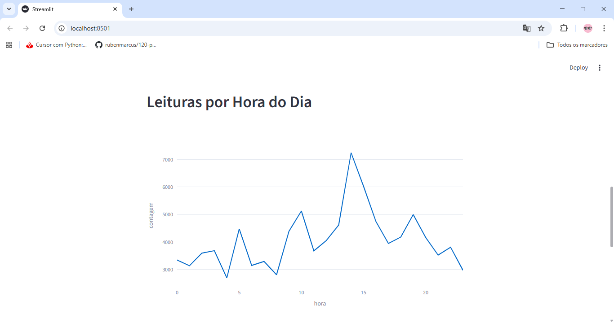

# Pipeline de Dados IoT com Docker e PostgreSQL

## Descrição do Projeto
Este projeto consiste em um **pipeline de dados** que processa leituras de temperatura de dispositivos IoT e armazena os dados em um **banco de dados PostgreSQL** usando Docker. Além disso, foi desenvolvido um **dashboard em Streamlit** para visualização dos dados processados.

O objetivo é demonstrar o fluxo completo: **extração**, **processamento**, **armazenamento** e **visualização** dos dados.

---

## Estrutura do Projeto

```
Projeto_Pipeline_De_Dados_IOT
|
├─ csv
|   └─ IOT-temp.csv
├─ docs
├─ pipeline_dados
|   ├─ __init__.py
|   ├─ create_views.py
|   ├─ data_loader.py
|   ├─ postgres_manager.py
|   └─ streamlit_app.py
├─ poetry.lock
├─ pyproject.toml
└─ README.md
```

## Pré-requisitos
- Python 3.9+
- Docker
- PostgreSQL
- Bibliotecas Python:

```
pip install pandas psycopg2-binary sqlalchemy streamlit plotly
```

## Passo a Passo
#### 1. Rodando o PostgreSQL com Docker

```
docker run --name postgres-iot -e POSTGRES_PASSWORD=12345 -e POSTGRES_DB=database -p 5432:5432 -d postgres
```


#### 2. Criando a Tabela no PostgreSQL

Execute o script `postgres_manager.py` para criar a tabela `iot_temp_log`:

| Coluna       | Tipo                |
|--------------|-------------------|
| id           | VARCHAR(100) PRIMARY KEY |
| room_id      | VARCHAR(100)       |
| noted_date   | TIMESTAMP          |
| temperature  | FLOAT              |
| location     | VARCHAR(10)        |

#### 3. Inserindo os Dados

Use data_loader.py para ler o CSV e inserir os dados na tabela iot_temp_log.

- Converte o timestamp para o formato PostgreSQL.

- Converte a temperatura para float.

- Ignora conflitos de id duplicados.

##### Executando:

```
python pipeline_dados/postgres_manager.py
```

#### 4. Criando as Views SQL

Execute create_views.py para criar as views utilizadas no dashboard:

##### 1. Média de temperatura por local (In / Out)

```
    CREATE OR REPLACE VIEW avg_temp_por_local AS
    SELECT location, AVG(temperature) AS avg_temp
    FROM iot_temp_log
    GROUP BY location;
```

##### 2. Leituras por hora do dia

```
    CREATE OR REPLACE VIEW leituras_por_hora AS
    SELECT EXTRACT(HOUR FROM noted_date) AS hora, COUNT(*) AS contagem
    FROM iot_temp_log
    GROUP BY EXTRACT(HOUR FROM noted_date)
    ORDER BY hora;
```

##### 3. Temperatura máxima e mínima por dia

```
    CREATE OR REPLACE VIEW temp_max_min_por_dia AS
    SELECT DATE(noted_date) AS data,
        MAX(temperature) AS temp_max,
        MIN(temperature) AS temp_min
    FROM iot_temp_log
    GROUP BY DATE(noted_date)
    ORDER BY data;
```

##### Executando:

```
python pipeline_dados/create_views.py
```


## Dashboard Streamlit
##### 1. Executando

```
streamlit run pipeline_dados/streamlit_app.py
```

##### 2. Funcionalidades

- Tabela de Leituras de Temperaturas (Dados Brutos)


- Média de temperatura por local (In / Out):


Gráfico de barras mostrando a média para sensores internos e externos.

- Leituras por hora do dia: 



Gráfico de linha mostrando a quantidade de leituras por hora.

- Temperaturas máximas e mínimas por dia: 


Gráfico de linha mostrando variação diária.

## Insights Obtidos

- Sensores internos (In) têm temperaturas mais estáveis.

- Sensores externos (Out) apresentam maior variação, provavelmente por influência ambiental.

- Horários de maior registro de leituras indicam picos de atividade dos sensores.

## GitHub

##### 1. Inicialize o repositório:

```
git init
git add .
git commit -m "Projeto inicial: Pipeline de Dados IoT"
```

##### 2. Conecte ao repositório remoto e faça push:

```
git remote add origin https://github.com/Ingridxisto/Pipeline-de-Dados-com-IoT-e-Docker.git
git push -u origin main
```

## Referências

- Documentação Teórica: [docs/Documentacao_Pipeline_IoT.pdf](docs/)

- CSV do Kaggle: [Temperature Readings: IoT Devices](https://www.kaggle.com/datasets/atulanandjha/temperature-readings-iot-devices)

- [Documentação Streamlit](https://docs.streamlit.io/?utm_source=chatgpt.com)

- [Documentação SQLAlchemy](https://docs.sqlalchemy.org/en/20/)
